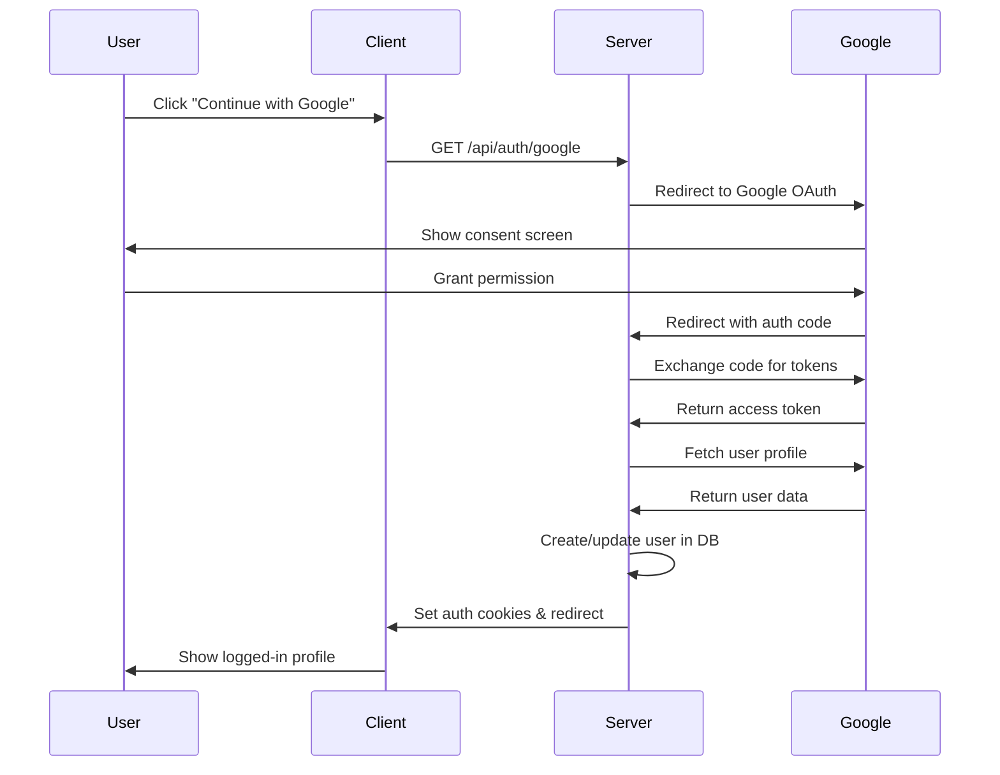

# 🔐 Google Authentication Implementation Guide for Melodia

This guide provides complete step-by-step instructions to implement Google OAuth authentication in your Melodia website.

## 📋 **Prerequisites**

- Google Cloud Console account
- Next.js project with existing authentication system
- Database with users table

## 🔑 **Step 1: Google Cloud Console Setup**

### 1.1 Create Google Cloud Project

1. Go to [Google Cloud Console](https://console.cloud.google.com/)
2. Create a new project or select existing one
3. Note your **Project ID**

### 1.2 Enable Required APIs

1. Navigate to **APIs & Services** → **Library**
2. Enable the following APIs:
   - **Google+ API** (for user profile access)
   - **Google Identity** API
   - **People API** (optional, for extended profile info)

### 1.3 Create OAuth 2.0 Credentials

1. Go to **APIs & Services** → **Credentials**
2. Click **Create Credentials** → **OAuth 2.0 Client IDs**
3. Configure the OAuth consent screen first if prompted:
   - **Application type**: External
   - **Application name**: Melodia Website
   - **User support email**: Your email
   - **Developer contact information**: Your email
4. Create OAuth 2.0 Client ID:
   - **Application type**: Web application
   - **Name**: Melodia Web Client
   - **Authorized JavaScript origins**:
     ```
     http://localhost:3000
     https://yourdomain.com
     ```
   - **Authorized redirect URIs**:
     ```
     http://localhost:3000/api/auth/google/callback
     https://yourdomain.com/api/auth/google/callback
     ```

### 1.4 Download Credentials

After creating the OAuth client, you'll get:
- **Client ID**: `1234567890-abcdefghijklmnopqrstuvwxyz.apps.googleusercontent.com`
- **Client Secret**: `GOCSPX-abcdefghijklmnopqrstuvwxyz`

## 🔧 **Step 2: Environment Configuration**

### 2.1 Update Environment Variables

Add these to your `.env.local` file:

```bash
# Google OAuth Configuration
GOOGLE_CLIENT_ID=your-google-client-id.googleusercontent.com
GOOGLE_CLIENT_SECRET=your-google-client-secret

# NextAuth Configuration
NEXTAUTH_URL=http://localhost:3000
NEXTAUTH_SECRET=your-nextauth-secret-key-here

# Production URLs (update for deployment)
# NEXTAUTH_URL=https://yourdomain.com
```

### 2.2 Generate NextAuth Secret

Generate a secure secret for NextAuth:

```bash
openssl rand -base64 32
```

Or use online generator: https://generate-secret.vercel.app/32

## 📁 **Step 3: File Structure**

The implementation includes these new files:

```
src/
├── lib/
│   ├── auth/
│   │   └── nextauth.ts                    # NextAuth configuration
│   └── services/
│       └── google-auth-service.ts         # Google OAuth service
├── app/
│   ├── api/
│   │   └── auth/
│   │       ├── [...nextauth]/
│   │       │   └── route.ts              # NextAuth API route
│   │       └── google/
│   │           ├── route.ts              # Google OAuth initiation
│   │           └── callback/
│   │               └── route.ts          # Google OAuth callback
│   └── profile/
│       └── page.tsx                      # Updated profile page
├── components/
│   └── forms/
│       └── GoogleAuthButton.tsx          # Updated Google auth button
└── contexts/
    └── AuthContext.tsx                   # Updated with Google auth
```

## 🔄 **Step 4: Authentication Flow**

### 4.1 User Flow

1. **User clicks "Continue with Google"**
2. **Redirect to Google OAuth** (`/api/auth/google`)
3. **User authorizes on Google**
4. **Google redirects back** (`/api/auth/google/callback`)
5. **Server processes callback**:
   - Exchanges code for tokens
   - Fetches user info from Google
   - Creates/updates user in database
   - Sets authentication cookies
6. **User redirected to logged-in profile**

### 4.2 Technical Flow



## 🛠 **Step 5: Database Schema**

Ensure your `users` table has these fields:

```sql
CREATE TABLE users (
  id SERIAL PRIMARY KEY,
  email VARCHAR(255) UNIQUE NOT NULL,
  name VARCHAR(255),
  password_hash VARCHAR(255), -- Optional for Google users
  email_verified BOOLEAN DEFAULT FALSE,
  created_at TIMESTAMP DEFAULT NOW(),
  updated_at TIMESTAMP DEFAULT NOW()
);
```

## 🎨 **Step 6: UI Components**

### 6.1 GoogleAuthButton Features

- Loading state with spinner
- Disabled state handling
- Design system compliance
- Accessibility support

### 6.2 Profile Page Features

- Matches exact design from Figma
- Error handling for OAuth failures
- Success message display
- Responsive design
- Bottom navigation

## 🔒 **Step 7: Security Considerations**

### 7.1 Environment Security

- Never commit `.env.local` to version control
- Use different credentials for development/production
- Rotate secrets regularly

### 7.2 OAuth Security

- HTTPS required in production
- Secure cookie settings
- CSRF protection via NextAuth
- Token expiration handling

### 7.3 Database Security

- Email verification for Google users (auto-verified)
- Proper user data validation
- SQL injection prevention via Drizzle ORM

## 🚀 **Step 8: Deployment**

### 8.1 Update OAuth Settings

For production deployment:

1. Add production domain to Google OAuth settings
2. Update `NEXTAUTH_URL` environment variable
3. Ensure HTTPS is enabled

### 8.2 Environment Variables

Set these in your deployment platform:

```bash
GOOGLE_CLIENT_ID=your-production-client-id
GOOGLE_CLIENT_SECRET=your-production-client-secret
NEXTAUTH_URL=https://yourdomain.com
NEXTAUTH_SECRET=your-production-secret
```

## 🧪 **Step 9: Testing**

### 9.1 Local Testing

1. Start development server: `npm run dev`
2. Navigate to `/profile`
3. Click "Continue with Google"
4. Complete OAuth flow
5. Verify user creation in database

### 9.2 Test Cases

- [ ] Google OAuth initiation
- [ ] Successful authentication
- [ ] User creation for new users
- [ ] User update for existing users
- [ ] Error handling for OAuth failures
- [ ] Logout functionality
- [ ] Session persistence

## 🐛 **Step 10: Troubleshooting**

### 10.1 Common Issues

**"redirect_uri_mismatch" error:**
- Check OAuth redirect URIs in Google Console
- Ensure exact match with callback URL

**"access_denied" error:**
- User cancelled OAuth flow
- Check OAuth consent screen configuration

**Database connection errors:**
- Verify database credentials
- Check user table schema

**Cookie/session issues:**
- Verify `NEXTAUTH_SECRET` is set
- Check cookie domain settings

### 10.2 Debug Mode

Enable debug logging in development:

```bash
NEXTAUTH_DEBUG=true
```

## 📚 **Step 11: Additional Resources**

- [NextAuth.js Documentation](https://next-auth.js.org/)
- [Google OAuth 2.0 Documentation](https://developers.google.com/identity/protocols/oauth2)
- [Google Cloud Console](https://console.cloud.google.com/)

## 🎯 **Key Benefits**

✅ **Seamless user experience** - One-click authentication
✅ **Enhanced security** - No password management needed
✅ **Faster onboarding** - Pre-verified email addresses
✅ **Better conversion** - Reduced friction in signup process
✅ **Mobile-friendly** - Works across all devices
✅ **Design system compliant** - Matches Melodia's visual identity

## 📝 **Next Steps**

After implementing Google authentication:

1. **Test thoroughly** in development and staging
2. **Monitor authentication metrics** and user adoption
3. **Consider adding other providers** (Facebook, Apple, etc.)
4. **Implement user profile management** features
5. **Add social login analytics** tracking

---

**Need help?** Check the troubleshooting section or review the implementation files for detailed code examples.
